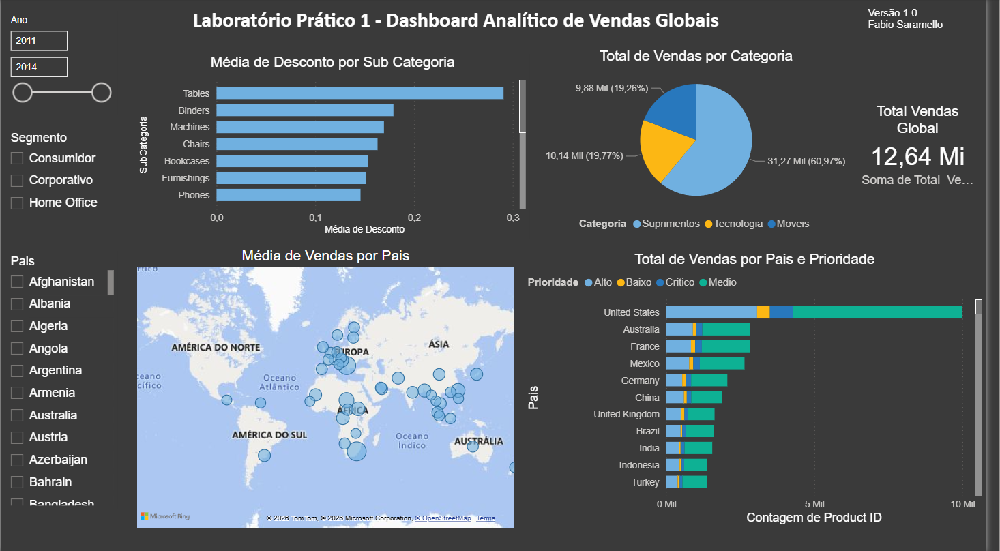

# Lab 1: Global Sales Analytical Dashboard

## 📝 Project Overview
This is the first hands-on lab developed during my Power BI studies. The main objective was to apply fundamental concepts of data ingestion, transformation, and dynamic visual reporting. 

The project analyzes sales data from a fictitious global retail company, allowing both macro and micro views of commercial performance.

---

## 💼 Business Challenge
The dashboard was built to answer 5 strategic business questions:
1. **What is the total sales revenue?**
2. **What is the sales volume per product category?**
3. **How are sales distributed by country and delivery priority?**
4. **What is the average discount applied per product subcategory?**
5. **Which countries have the highest average sales value?** (Geographical visualization).

**Filtering Capabilities:** Users can dynamically slice the data by **Year**, **Segment**, and **Country**.

---

## 🛠️ Tools & Features Used
* **Power BI Desktop**
* **Data Import:** Loading data from a flat file.
* **Native Aggregations:** Utilizing Power BI's built-in functions (Sum, Average) directly on the visuals without complex DAX coding.
* **Standard Visuals:** Bar charts, Pie chart, KPI Cards, and a Map.

---

## 📊 Dashboard Preview

----

## 🚀 How to View
Download the `.pbix` file from the `pbix` folder and open it in Power BI Desktop to interact with the dashboard.
