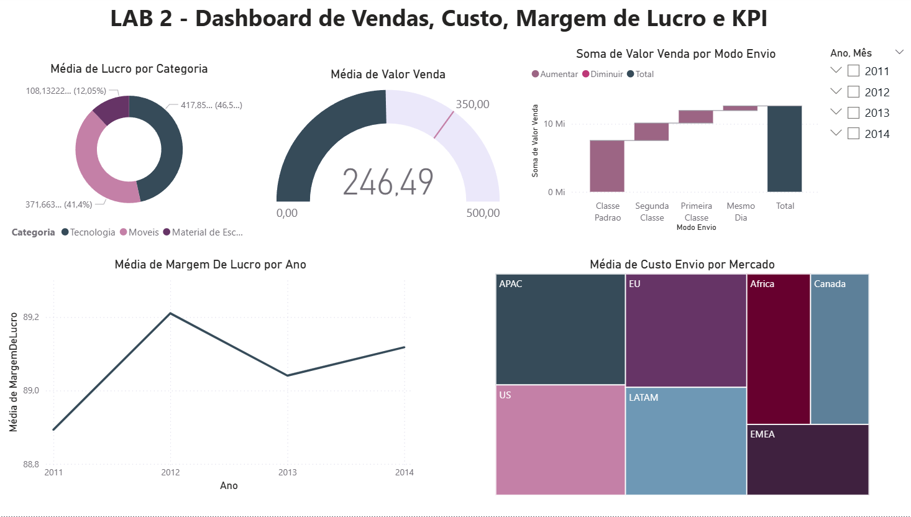

# Lab 2: Shipping & Profitability Analytics Dashboard

## 📝 About the Project
This second hands-on lab focuses on more advanced analytical and business requirements, such as tracking organizational goals (KPIs), analyzing financial trends over time, and implementing custom calculations using DAX.

## 🛠️ Data Cleaning & ETL (Power Query)
Before building the visuals, the dataset required significant structural adjustments to ensure data quality:
* **Header Standardization:** Fixed generic column names (e.g., "Column1", "Header1") by promoting the correct first rows to headers and renaming them for clarity.
* **Deduplication:** Identified and removed duplicated rows across the tables to prevent artificial inflation of metrics.
* **Data Type Correction:** Adjusted text, date, and monetary formats.

## 🧮 Data Modeling & DAX (Data Analysis Expressions)
To meet the specific business rules of this challenge, I moved beyond native aggregations and implemented custom analytical logic using DAX:
* **Calculated Column:** Created a calculated column to determine the absolute profit for each row using the exact business logic:  
  `Lucro = TabelaVendas[Valor Venda] - TabelaVendas[Custo Envio]`
* **DAX Measure:** Developed a dynamic DAX measure to calculate the profit margin percentage safely, preventing division-by-zero errors:  
  `Margem Lucro = DIVIDE(SUM(TabelaVendas[Lucro]), SUM(TabelaVendas[Valor Venda]))`

## 🎯 Business Challenge & Visual Solutions
The dashboard effectively answers the 5 strategic exercises:

1. **Sales by Shipping Mode:** Displayed using a **Waterfall Chart** to show how each shipping method contributes to total revenue.
2. **Average Shipping Cost by Market:** Represented via a **Treemap** to easily spot which regional markets demand the highest shipping expenses.
3. **Monthly Sales Target (KPI):** Built a **KPI Card** tracking the company's goal of maintaining a 350 average sales value. *(Note: Using the Year and Month slicers, it is clear that in April 2014, the overall average of 246.42 was below the established target).*
4. **Product Category Profitability:** Analyzed via the calculated profit column to identify which product category yielded the highest average profit.
5. **Profit Margin Over Time:** Evaluated the profit margin behavior across a timeline using a **Line Chart** to detect trends and performance drops.

## 🛠️ Tools Used
* **Power BI Desktop**
* **Power Query** (Advanced data transformation & deduplication)
* **DAX** (Calculated Columns and Performance Measures)

## 📊 Dashboard Preview

---
## 🚀 How to View
Download the `.pbix` file from this folder and open it in Power BI Desktop to explore the interactive report.
