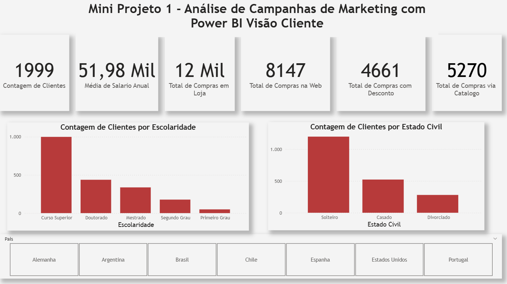
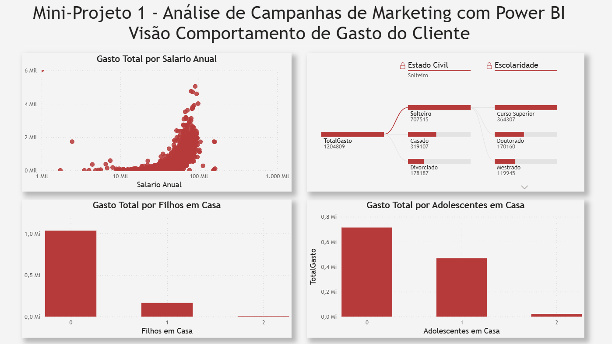
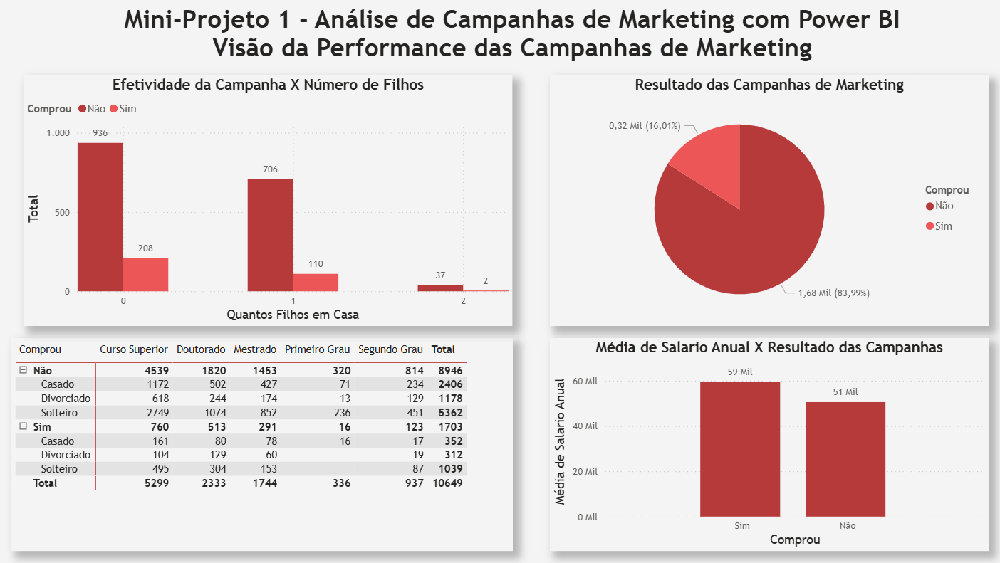
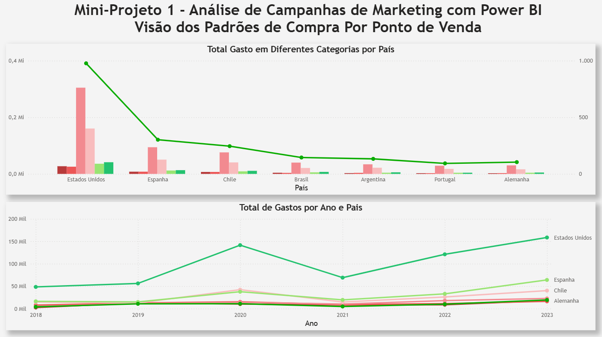

[🇺🇸 English Version](#-english-version) | [🇧🇷 Versão em Português](#-versão-em-português)

---

## 🇺🇸 English Version

# Marketing Campaign Analysis with Power BI 📊

### 📌 Executive Summary
This project delivers a comprehensive Business Intelligence solution to evaluate marketing campaign performance, map customer purchasing behavior, and track global revenue streams. By transforming raw, unoptimized data into an interactive 4-page Power BI report, this project empowers stakeholders to make data-driven decisions regarding marketing budget allocation and customer targeting.

### 🏢 Business Scenario & Objectives
A global enterprise needed visibility into the ROI of its recent marketing campaigns and a deeper understanding of its customer base. The core objectives of this analysis were:
1. Identify the demographic profile of the most profitable customers.
2. Understand how family structure and education impact overall spending.
3. Calculate the conversion rate of marketing campaigns and identify success patterns.
4. Track revenue trends across different international markets over time.

### ⚙️ Data Architecture & Technical Pipeline
This project encompasses the entire data analysis workflow, from extraction to data visualization:

* **ETL & Data Quality (Power Query):** Conducted rigorous data profiling and cleaning. Identified and removed critical outliers (e.g., severe data entry errors in the "Annual Salary" column) to ensure metric accuracy and preserve the integrity of visual scales.
* **Data Modeling:** Structured the relational model to allow seamless cross-filtering across geographic, demographic, and temporal dimensions.
* **DAX Expressions:** Engineered dynamic measures for precise aggregations. A core implementation was calculating total cross-category spending respecting row context using iterator functions:
  ```dax
  TotalGasto = SUMX(
      DadosMarketing, 
      DadosMarketing[Gasto com Alimentos] + DadosMarketing[Gasto com Brinquedos] + 
      DadosMarketing[Gasto com Eletronicos] + DadosMarketing[Gasto com Moveis] + 
      DadosMarketing[Gasto com Utilidades] + DadosMarketing[Gasto com Vestuario]
  )
## 🚀 Navigating the Dashboard

### 1. Customer View
Provides a demographic summary of the 2,000 customers, including average salary and preferred purchasing channels.


### 2. Behavioral View
Deep dive into spending habits using Decomposition Trees and analyzing family structure impact.


### 3. Campaign View
Conversion rates and specific audience targeting to analyze marketing effectiveness.


### 4. POS View
Geographic and temporal sales distribution from 2018 to 2023.


#####################################

Análise de Campanhas de Marketing com Power BI 📊
📌 Resumo Executivo
Este projeto entrega uma solução abrangente de Business Intelligence para avaliar a performance de campanhas de marketing, mapear o comportamento de compra do cliente e rastrear o fluxo global de receitas. Ao transformar dados brutos e não otimizados em um relatório interativo de 4 páginas no Power BI, este projeto capacita os tomadores de decisão a direcionar orçamentos de marketing e segmentar clientes com base em dados.

🏢 Cenário de Negócios e Objetivos
Uma empresa global precisava de visibilidade sobre o ROI de suas campanhas de marketing recentes e um entendimento mais profundo de sua base de clientes. Os principais objetivos desta análise foram:

Identificar o perfil demográfico dos clientes mais rentáveis.

Entender como a estrutura familiar e a escolaridade impactam o gasto total.

Calcular a taxa de conversão das campanhas de marketing e identificar padrões de sucesso.

Acompanhar as tendências de receita em diferentes mercados internacionais ao longo do tempo.

⚙️ Arquitetura de Dados e Pipeline Técnico
Este projeto abrange todo o fluxo de análise de dados, desde a extração até a visualização:

ETL e Qualidade de Dados (Power Query): Realização de limpeza e perfilamento rigoroso dos dados. Outliers críticos foram identificados e removidos (ex: erros graves de digitação na coluna "Salário Anual") para garantir a precisão das métricas e preservar a integridade das escalas visuais.

Modelagem de Dados: Estruturação do modelo relacional para permitir cruzamento de filtros de forma fluida entre dimensões geográficas, demográficas e temporais.

Expressões DAX: Criação de medidas dinâmicas para agregações precisas. Uma implementação central foi o cálculo do gasto total cruzando categorias e respeitando o contexto de linha por meio de funções iteradoras:

Snippet de código
TotalGasto = SUMX(
    DadosMarketing, 
    DadosMarketing[Gasto com Alimentos] + DadosMarketing[Gasto com Brinquedos] + 
    DadosMarketing[Gasto com Eletronicos] + DadosMarketing[Gasto com Moveis] + 
    DadosMarketing[Gasto com Utilidades] + DadosMarketing[Gasto com Vestuario]
)
🚀 Navegando pelo Dashboard
  
1. Visão do Cliente
Fornece um resumo demográfico dos 2.000 clientes, incluindo salário médio e canais de compra preferidos.


3. Visão de Comportamento
Análise profunda dos hábitos de consumo usando Árvores de Decomposição e analisando o impacto da estrutura familiar.


4. Visão de Campanhas
Taxas de conversão e segmentação de público específico para analisar a eficácia do marketing.


5. Visão de Ponto de Venda (País)
Distribuição geográfica e temporal das vendas de 2018 a 2023.

